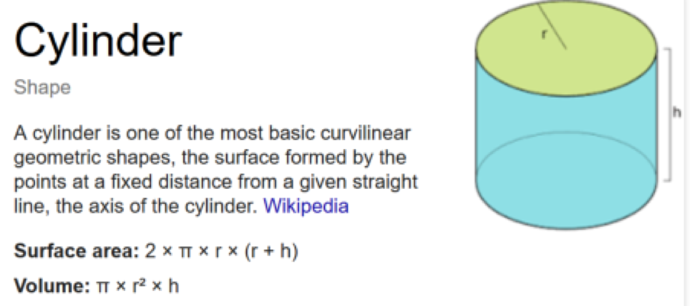

# Assignment 2

 Given the following:

Radius = 8.67 Height = 25.85 Volume = π _ radius^2 _ height Write a short C++ program that will calculate the volume of the cylinder using the following formula:

Recall that π = 3.14159. Use good programming practices.

See answer [`assignment2.cpp`](02-cylinder/assignment2.md)

See code on Github [here](https://github.com/19cah/mdc/blob/master/cpp/Assignment%202/assignment2/assignment2.cpp)

[←Back](02-cylinder-1.md)

