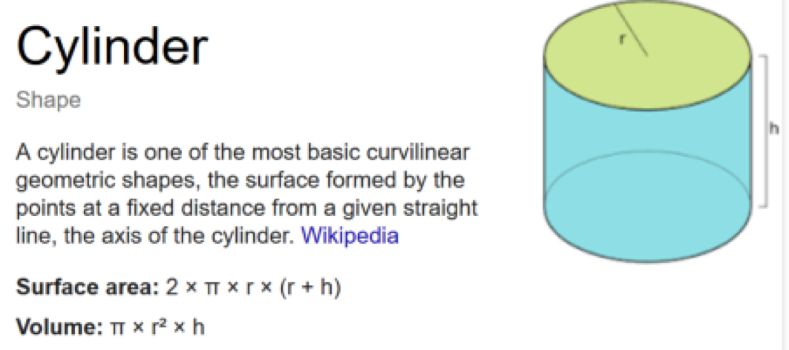

## Assignment 2

Given the following:

```
Radius = 8.67
Height = 25.85
Volume = π _ radius^2 _ height
```

### What to do?

Write a short C++ program that will calculate the volume of the cylinder using the following formula:

&nbsp;&nbsp;&nbsp;



&nbsp;&nbsp;&nbsp;

Recall that `π = 3.14159`. Use good programming practices.
